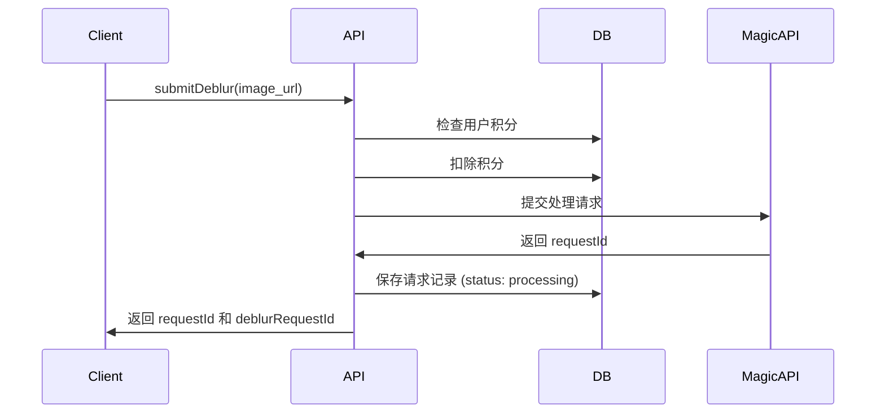
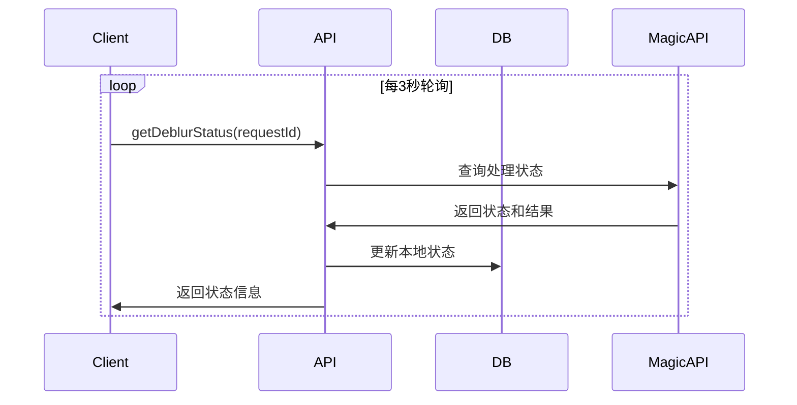

# 数据库使用说明文档

## 概述

本文档详细说明了 ImageUnblur 应用中的数据库设计和使用方式，特别是关于图片去模糊业务的数据管理。

## 数据库表结构

### 1. `deblur_requests` 表

专门用于管理图片去模糊请求的核心表。

#### 表字段说明

| 字段名 | 类型 | 说明 | 约束 |
|--------|------|------|------|
| `id` | UUID | 主键，自动生成 | PRIMARY KEY |
| `userId` | UUID | 关联用户ID | NOT NULL, FK to users.id |
| `clerkId` | VARCHAR(256) | Clerk 用户ID | NOT NULL |
| `requestId` | VARCHAR(256) | MagicAPI 请求ID | UNIQUE, NOT NULL |
| `status` | ENUM | 处理状态 | NOT NULL, DEFAULT 'pending' |
| `originalImageUrl` | VARCHAR(512) | 原始模糊图片URL | NOT NULL |
| `processedImageUrl` | VARCHAR(512) | 处理后清晰图片URL | 可为空，临时URL |
| `processingStartedAt` | TIMESTAMP | 处理开始时间 | 可为空 |
| `processingCompletedAt` | TIMESTAMP | 处理完成时间 | 可为空 |
| `expiresAt` | TIMESTAMP | 处理后图片URL过期时间 | 可为空 |
| `creditsCost` | INTEGER | 消耗积分数 | NOT NULL, DEFAULT 1 |
| `errorMessage` | TEXT | 错误信息 | 可为空 |
| `createdAt` | TIMESTAMP | 创建时间 | NOT NULL |
| `updatedAt` | TIMESTAMP | 更新时间 | 自动更新 |

#### 状态枚举值

```typescript
type DeblurStatus = "pending" | "processing" | "completed" | "failed"
```

- `pending`: 待处理
- `processing`: 处理中
- `completed`: 处理完成
- `failed`: 处理失败

### 2. 相关表关系

- **users** 表：通过 `userId` 外键关联，支持级联删除
- **billings** 表：通过用户关联，用于积分扣除记录

## 业务流程

### 1. 提交去模糊请求



#### 数据库操作

1. **积分检查与扣除**
   ```sql
   -- 检查用户积分是否足够
   SELECT credit, bonusCredit FROM users WHERE clerkId = ?

   -- 扣除积分
   UPDATE users SET
     credit = ?,
     bonusCredit = ?
   WHERE clerkId = ?
   ```

2. **保存请求记录**
   ```sql
   INSERT INTO deblur_requests (
     userId, clerkId, requestId, status,
     originalImageUrl, creditsCost, processingStartedAt
   ) VALUES (?, ?, ?, 'processing', ?, 1, NOW())
   ```

### 2. 查询处理状态



#### 数据库操作

1. **查询本地记录**
   ```sql
   SELECT * FROM deblur_requests WHERE requestId = ?
   ```

2. **更新完成状态**
   ```sql
   UPDATE deblur_requests SET
     status = 'completed',
     processedImageUrl = ?,
     processingCompletedAt = NOW(),
     expiresAt = NOW() + INTERVAL '10 minutes'
   WHERE requestId = ?
   ```

3. **更新失败状态**
   ```sql
   UPDATE deblur_requests SET
     status = 'failed',
     errorMessage = ?,
     processingCompletedAt = NOW()
   WHERE requestId = ?
   ```

### 3. 历史记录查询

```sql
-- 获取用户的去模糊历史记录
SELECT * FROM deblur_requests
WHERE clerkId = ?
ORDER BY createdAt DESC
LIMIT ? OFFSET ?
```

## 数据生命周期管理

### 1. 临时URL管理

- **处理后的图片URL** 由 MagicAPI 提供，**10分钟后自动过期**
- 应用不存储图片到 Cloudflare R2，仅使用临时URL
- 客户端应立即下载并缓存到本地

### 2. 数据清理策略

#### 过期URL清理

```sql
-- 清理已过期的处理后图片URL
UPDATE deblur_requests
SET processedImageUrl = NULL
WHERE expiresAt < NOW()
  AND processedImageUrl IS NOT NULL
```

#### 定期清理建议

- **每小时** 清理过期的 `processedImageUrl`
- **每月** 归档超过30天的完成记录
- **每季度** 删除超过90天的失败记录

## 索引策略

### 主要索引

```sql
-- 用户查询索引
CREATE INDEX deblur_request_clerkId_idx ON deblur_requests(clerkId);

-- 请求ID查询索引
CREATE INDEX deblur_request_requestId_idx ON deblur_requests(requestId);

-- 状态查询索引
CREATE INDEX deblur_request_status_idx ON deblur_requests(status);

-- 时间排序索引
CREATE INDEX deblur_request_createdAt_idx ON deblur_requests(createdAt);
```

### 查询优化建议

1. **按用户查询** - 使用 `clerkId` 索引
2. **状态轮询** - 使用 `requestId` 索引
3. **历史记录** - 使用 `clerkId + createdAt` 复合索引
4. **清理任务** - 使用 `expiresAt` 索引

## API 接口说明

### 1. `submitDeblur`

**权限**: 需要登录

**输入参数**:
```typescript
{
  image_url: string // 待处理图片的URL
}
```

**返回结果**:
```typescript
{
  success: boolean,
  requestId: string,          // MagicAPI 请求ID
  deblurRequestId: string,    // 数据库记录ID
  creditsRemaining: {
    credit: number,
    bonusCredit: number
  }
}
```

### 2. `getDeblurStatus`

**权限**: 公开访问

**输入参数**:
```typescript
{
  requestId: string,              // MagicAPI 请求ID
  deblurRequestId?: string        // 可选的数据库记录ID
}
```

**返回结果**:
```typescript
{
  status: string,                 // 处理状态
  image_url?: string,            // 处理后图片URL (临时)
  original_url: string,          // 原始图片URL
  expires_in_minutes?: number,   // URL过期分钟数
  warning?: string               // 过期警告信息
}
```

### 3. `getDeblurHistory`

**权限**: 需要登录

**输入参数**:
```typescript
{
  limit?: number,    // 限制条数，默认10，最大50
  offset?: number    // 偏移量，默认0
}
```

**返回结果**:
```typescript
Array<{
  id: string,
  requestId: string,
  status: DeblurStatus,
  originalImageUrl: string,
  processedImageUrl?: string,
  creditsCost: number,
  createdAt: Date,
  // ... 其他字段
}>
```

### 4. `cleanupExpiredRequests`

**权限**: 需要登录

**说明**: 清理用户的过期图片URL

**返回结果**:
```typescript
{
  success: boolean,
  message: string
}
```

## 最佳实践

### 1. 前端实现

- **轮询间隔**: 建议3秒轮询一次状态
- **本地缓存**: 立即下载并缓存处理后的图片
- **错误处理**: 优雅处理网络错误和API限制
- **用户体验**: 显示处理进度和剩余时间

### 2. 后端实现

- **积分管理**: 先扣积分，失败时退还
- **错误日志**: 记录详细的错误信息
- **监控告警**: 监控API调用成功率和响应时间
- **数据一致性**: 确保数据库状态与API状态同步

### 3. 运维建议

- **定期清理**: 设置自动清理任务
- **监控指标**: 跟踪请求量、成功率、处理时间
- **备份策略**: 定期备份重要的用户数据
- **性能优化**: 根据查询模式调整索引

## 故障排查

### 常见问题

1. **状态不同步**
   - 检查 MagicAPI 响应
   - 验证数据库更新逻辑
   - 确认轮询是否正常工作

2. **积分扣除异常**
   - 检查并发控制
   - 验证事务完整性
   - 确认用户积分余额

3. **URL过期问题**
   - 确认过期时间设置
   - 检查清理任务执行
   - 验证前端缓存逻辑

### 调试工具

```sql
-- 查看用户最近的请求
SELECT * FROM deblur_requests
WHERE clerkId = 'user_xxx'
ORDER BY createdAt DESC
LIMIT 10;

-- 统计各状态的请求数量
SELECT status, COUNT(*)
FROM deblur_requests
GROUP BY status;

-- 查看过期的URL
SELECT COUNT(*)
FROM deblur_requests
WHERE expiresAt < NOW()
  AND processedImageUrl IS NOT NULL;
```

---

*最后更新时间: 2025年6月29日*
